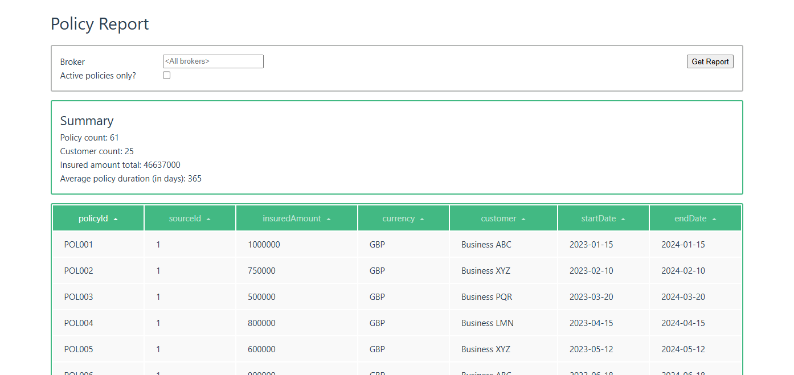

# Policy Reporter

This project provides a proof-of-concept (PoC) solution for aggregating insurance policy data from multiple brokers.

There are three core components to the solution:

### 1. Aggregator command-line tool

#### Reads data from a number of sources, parses and normalises the data into policy records and persists these records.

In this PoC, this tool is configured to read from two example CSV files and the resultant policies are stored in an SQLite database.

### 2. Policy Reporter server

#### Generates and exposes policy reports from persisted records.

In this PoC, this application reads from the SQLite database, allows policies to be filtered by broker and active state, and serves all results in a single page.

### 3. Policy Reporter client application

#### Presents policy reports to an end use with controls to filter results.

## Running the solution

**Prerequisites**: .NET SDK.

To demonstrate the PoC:

1. Checkout repository

2. Within the `PolicyReporter` directory, run:

   a. `dotnet run --project PolicyReporter.Aggregator`

   b. `dotnet run --project PolicyReporter.Server`

3. Open listed website

**Example:**

### Future enhancements

To take this solution further, the following enhancements (TODOs) would almost certainly be required:

- Rework of frontend (in Vue or otherwise)
   - Use off-the-shelf components for improved UX
   - Implement deep-linking
   - Evaluate localisation and formatting requirements
   - Isolate data types
   - Integrate configuration for production environments
   - Implement automated testing
- Improved data normalisation
   - Mapping of additional policy data (as per business needs)
   - Normalisation of insurance amounts (convert using current or historical currency exchange rates?)
- Data handling
   - Retrieval: paging of data (which may necessitate moving of statistics calculations to database queries)
   - Ingestion: batching of update queries to optimise aggregation
   - Add repository for broker metadata (to facilitate searching)
- Security
   - Consider data retention policies
   - Implement server authentication
   - Implement end user account management
